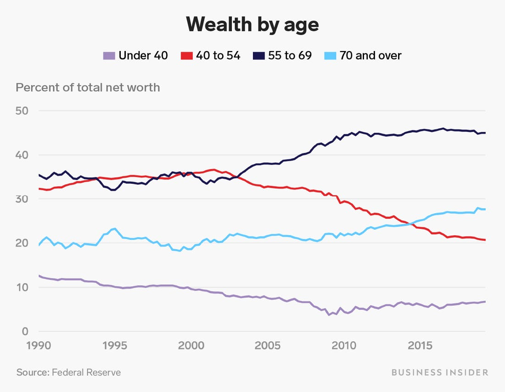

<link href="https://fonts.googleapis.com/css2?family=Raleway:wght@500;600;800;900&display=swap" rel="stylesheet">

---

## WE All WANT LONGER Life

Our biological clocks tick away.

Our telomeres shorten to critical lengths leading to apoptosis and naturally die.

---

## Why we age

### The key is your lipidinoid count

The fewer you have, the older you are. 

---

## We increase lipidinoids

Our patented machine transfers lipidinoids between people.

For the first time, biological age can go backwards.

---

## Let's make money 

Elderly have all the assets.

They will pay anything for age reversal

---

## Two-sided marketplace 

 * Cash-strapped young on supply side
 * Wealthy older on demand side

---

## demand is overwhelming

* $100,000 to reverse age 1 month 
* $9,000,000 average sale
* 1,500 on waiting list 

---

## Technical progress

 * Syfin 1.0: 1 week younger per 10 years of lipdinoids
 * Syfin 2.0: 1 **month** younger per 10 years of lipidinoids

We're passing those savings on to our customers 

---

## Just kidding

We pass the profits onto you. 

That's why you're here.

---

## Supply Side

* Newborn babies 
* Alternative to inaccessible abortions
* Test markets: Salt Lake City, Oklahoma City and Charleston

---

## pregnancy = Profit

* Producer payout: $7,500 + all medical costs per baby 
* 1 baby = 110 years of lipidinoids!
* v1 machine: $275,000 gross profit
* v2 machine: **$1,100,000** gross profit

$1,092,500 profit for 9 months of unskilled labor.

---

## our supply tech

 * MySyfin™ gig-economy app for baby-producers
 * Proof of pregnancy detector for Android/iOS
 * Artificial insemination kit to optimize process 
 * Genetic tests for twin-producers
 * Futures contracts: Loans available prior to baby production date

---

## Competition

 * Process is secret. Machine is patented. No plans to license
 * Synthetic lipidinoids are still 10 years away
 * Transfer recovery about 96 hours. Strict sleep, exercise, and diet is required
 * Organ transplants, skin grafting, and cosmetic surgery will hold on to markets
 * Growth sector is non-traditional vanity markets

---

# Financials

 * v2 machines are $10,000,000. Lasts 2 years
 * Clinic cost: $17,000/day
 * Average baby influx: 3.12/week
 * Full infant depletion: All lipinoids before cell degeneration are made productive

---

# Per unit annual profit 

 * v1 net per clinic: $11.7 million 
 * v2 net per clinic: $140.0 million (*est*)

---

# Raise amount

 * $750,000,000 in convertible notes at $4,000,000,000 valuation
 * 75 machines in wealthy countries w/o abortion: Saudi Arabia, UAE, Brazil, India, and Singapore
 * More baby-producers in poorer countries. Payout can be much lower
 * Medical tourism surcharge possible to avoid waitlist

---

# Raise amount cont.

 * 6-month lead time for v2 manufacturing 
 * Investors of over $10,000,000 skip waitlist
 * Global operation of 75 clinics in 6-9 months
 * Yosemite Capital & LiquidBank lead at $400,000,000

---

# Q&A

